# Import daily and monthly tsibbles


```r
# import bike violations

df_bike_violations <- readr::read_csv("Data/Processed/df_bike_violations_2023-09-16.csv")
```

```
## Rows: 126701 Columns: 14
## ── Column specification ────────────────────────────────────────────────────────
## Delimiter: ","
## chr  (6): violation_code, veh_category, city_nm, rpt_owning_cmd, location, d...
## dbl  (7): evnt_key, x_coord_cd, y_coord_cd, latitude, longitude, daily_total...
## dttm (1): violation_date
## 
## ℹ Use `spec()` to retrieve the full column specification for this data.
## ℹ Specify the column types or set `show_col_types = FALSE` to quiet this message.
```

```r
df_bike_violations <- df_bike_violations |>
  mutate(violation_code = as.factor(violation_code)) |>
  mutate(veh_category = as.factor(veh_category)) |>
  mutate(city_nm = as.factor(city_nm)) |>
  mutate(rpt_owning_cmd = as.factor(rpt_owning_cmd)) |>
  mutate(violation_date = as.POSIXct(violation_date))

# creat daily tsibble

# import and clean df_counts:
path3 <- "https://www.dropbox.com/s/nffkpwuz1u6kd5t/df_counts.csv?dl=1"
df_counts_dl <- readr::read_csv(path3)
```

```
## Rows: 3352648 Columns: 7
## ── Column specification ────────────────────────────────────────────────────────
## Delimiter: ","
## dbl  (6): countid, id, counts, status, daily_total, weekly_total
## dttm (1): date
## 
## ℹ Use `spec()` to retrieve the full column specification for this data.
## ℹ Specify the column types or set `show_col_types = FALSE` to quiet this message.
```

```r
df_counts <-df_counts_dl |> 
  group_by(date(date)) |>
  mutate(daily_total = sum(counts)) |>
  ungroup() |>
  group_by(yearweek(date)) |>
  mutate(weekly_total = sum(counts)) |>
  ungroup() |>
  arrange(date) |>
  select(!c("date(date)", "yearweek(date)", countid, status))


# create the daily counts tsibble
ts_daily_total <- df_bike_violations |> 
  group_by(violation_date = as_date(violation_date)) |> 
  summarise(daily_total_violations = n()) |> 
  as_tsibble(index = violation_date) |> 
  fill_gaps() |> 
  mutate(date = violation_date) |> 
  left_join(y = df_counts, by = "date", multiple = "any") |> 
  rename(daily_total_cyclists = daily_total)|> 
  select(-c(date, id, counts, weekly_total))

ts_daily_total |> 
  count_gaps()
```

<div data-pagedtable="false">
  <script data-pagedtable-source type="application/json">
{"columns":[{"label":[".from"],"name":[1],"type":["date"],"align":["right"]},{"label":[".to"],"name":[2],"type":["date"],"align":["right"]},{"label":[".n"],"name":[3],"type":["int"],"align":["right"]}],"data":[],"options":{"columns":{"min":{},"max":[10]},"rows":{"min":[10],"max":[10]},"pages":{}}}
  </script>
</div>

create a monthly data tsibble from cleaned daily tsibble


```r
ts_monthly_total <- ts_daily_total |> 
  index_by(year_month = ~ yearmonth(.)) |> 
  summarise(monthly_total_cyclists = sum(daily_total_cyclists),
            monthly_total_violations = sum(daily_total_violations, na.rm = TRUE)) |> 
  rename(violation_date = year_month)


ts_yearly_total <- ts_daily_total |> 
  index_by(year = ~ year(.)) |> 
  summarise(yearly_total_cyclists = sum(daily_total_cyclists),
            yearly_total_violations = sum(daily_total_violations, na.rm = TRUE)) |> 
  rename(violation_date = year)
```


# Forecasting: Monthly total riders

Let's see how the daily totals look


```r
ts_daily_total |> 
  autoplot(daily_total_cyclists)
```

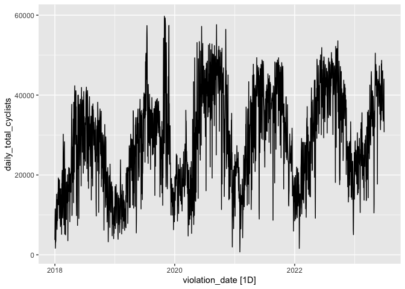<!-- -->

Pretty messy.  The monthly totals look easier to read, so let's use those:


```r
ts_monthly_total |> 
  autoplot(monthly_total_cyclists)
```

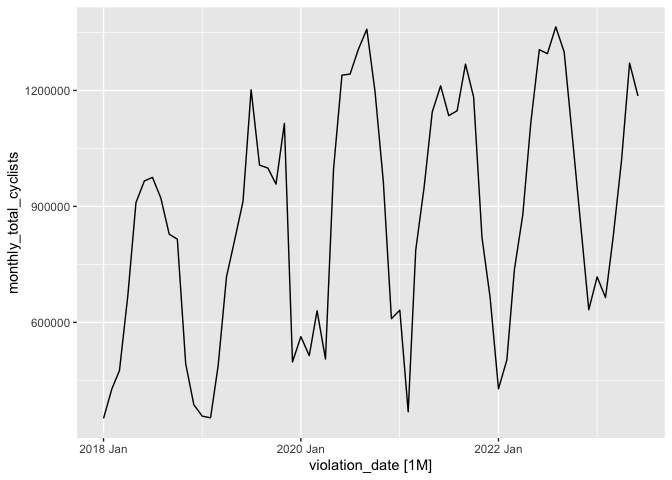<!-- -->


## Train and test sets for monthly data

Training set is through May of 2022.  Test set is from June 2022 through June 2023.


```r
set.seed(99)

train_monthly<-ts_monthly_total |> select(monthly_total_cyclists) |> filter_index(~"2022-05")
test_monthly<-ts_monthly_total |> select(monthly_total_cyclists) |> filter_index("2022-06"~.)

(range(train_monthly$violation_date))
```

```
## <yearmonth[2]>
## [1] "2018 Jan" "2022 May"
```

```r
(range(test_monthly$violation_date))
```

```
## <yearmonth[2]>
## [1] "2022 Jun" "2023 Jun"
```

```r
train_daily<-ts_daily_total |> select(daily_total_cyclists) |> filter_index(~"2022-05")
test_daily<-ts_daily_total |> select(daily_total_cyclists) |> filter_index("2022-06"~.)

(range(train_daily$violation_date))
```

```
## [1] "2018-01-01" "2022-05-31"
```

```r
(range(test_daily$violation_date))
```

```
## [1] "2022-06-01" "2023-06-30"
```

## Seasonal Naive forecast on monthly totals


```r
ts_monthly_snaive_mod <- ts_monthly_total |> 
  model(model = NAIVE(monthly_total_cyclists ~ lag(12)))

ts_fc <- ts_monthly_snaive_mod|> forecast(h = "2 years")

ts_fc |> 
  autoplot(ts_monthly_total)
```

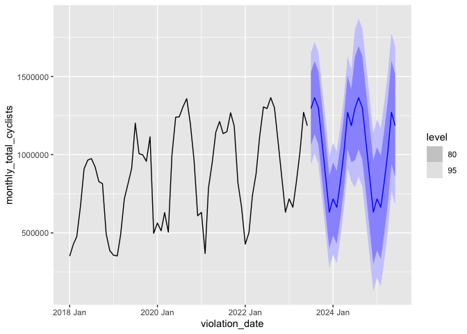<!-- -->


### Seasonal naive monthly residuals

lag = 12


```r
train_snaive_mod <- train_monthly |> 
  model(model = NAIVE(monthly_total_cyclists ~ lag(12)))

mean(augment(train_snaive_mod)$.resid, na.rm=TRUE)  # 70130.59 (changes each time?)
```

```
## [1] 70130.59
```

```r
gg_tsresiduals(train_snaive_mod)
```

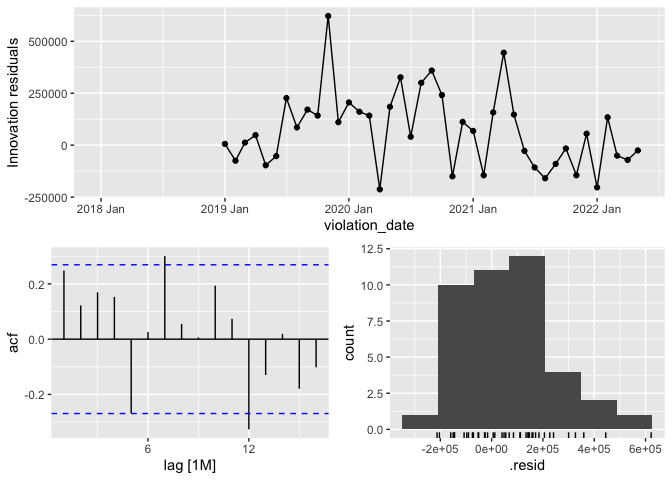<!-- -->

Tests to see if residuals differ from white noise:


```r
augment(train_snaive_mod) %>% features(.innov, box_pierce, lag = 12)
```

<div data-pagedtable="false">
  <script data-pagedtable-source type="application/json">
{"columns":[{"label":[".model"],"name":[1],"type":["chr"],"align":["left"]},{"label":["bp_stat"],"name":[2],"type":["dbl"],"align":["right"]},{"label":["bp_pvalue"],"name":[3],"type":["dbl"],"align":["right"]}],"data":[{"1":"model","2":"18.23497","3":"0.1087401"}],"options":{"columns":{"min":{},"max":[10]},"rows":{"min":[10],"max":[10]},"pages":{}}}
  </script>
</div>

```r
augment(train_snaive_mod) %>% features(.innov, ljung_box, lag = 12)
```

<div data-pagedtable="false">
  <script data-pagedtable-source type="application/json">
{"columns":[{"label":[".model"],"name":[1],"type":["chr"],"align":["left"]},{"label":["lb_stat"],"name":[2],"type":["dbl"],"align":["right"]},{"label":["lb_pvalue"],"name":[3],"type":["dbl"],"align":["right"]}],"data":[{"1":"model","2":"23.20207","3":"0.0260586"}],"options":{"columns":{"min":{},"max":[10]},"rows":{"min":[10],"max":[10]},"pages":{}}}
  </script>
</div>

Takeaways: passes box_pierce, but fails ljung_box.  Resids don't seem normal.  

### Seasonal Naive RMSE


```r
fct <-train_monthly |> 
  model(model = NAIVE(monthly_total_cyclists ~ lag(12))) |> 
  forecast(test_monthly)

(RMSE_seasonal_naive_monthly <-accuracy(fct, ts_monthly_total)$RMSE)
```

```
## [1] 139936.1
```

RMSE 139936.1

### Visualize the Seasonal Naive forecast:


```r
autoplot(train_monthly) +
  autolayer(fct, PI = F, size=0.7)+
  autolayer(test_monthly)
```

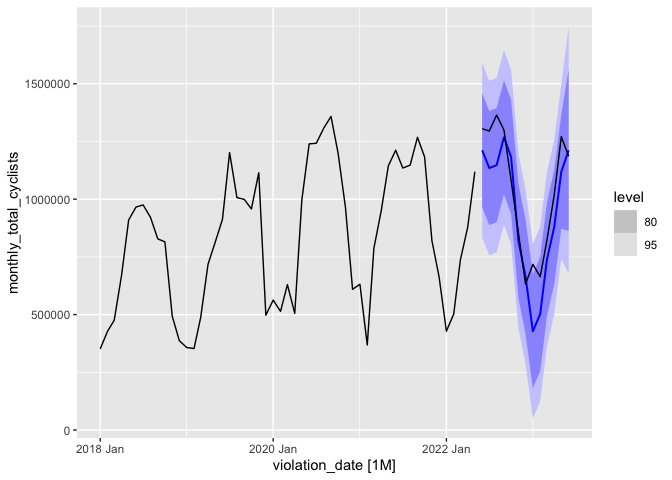<!-- -->

Takeaway:  Errors can get extreme (less than 0 at one point). Does not take into account the trend of the data.  Let's compare to other methods.


## Seasonal Naive daily 


```r
ts_daily_snaive_mod <- ts_daily_total |> 
  model(model = NAIVE(daily_total_cyclists ~ lag(365)))


ts_daily_total |> 
  count_gaps()
```

<div data-pagedtable="false">
  <script data-pagedtable-source type="application/json">
{"columns":[{"label":[".from"],"name":[1],"type":["date"],"align":["right"]},{"label":[".to"],"name":[2],"type":["date"],"align":["right"]},{"label":[".n"],"name":[3],"type":["int"],"align":["right"]}],"data":[],"options":{"columns":{"min":{},"max":[10]},"rows":{"min":[10],"max":[10]},"pages":{}}}
  </script>
</div>

```r
ts_fc <- ts_daily_snaive_mod|> forecast(h = "1 year")

ts_fc |> 
  autoplot(ts_daily_total)
```

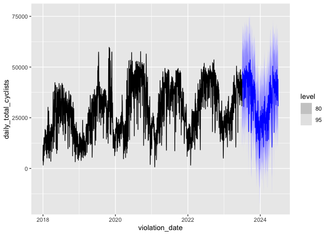<!-- -->

It's much more difficult to predict daily due to smaller period. Although it might be more accurate for forecast smaller time periods, like a single month, I would like to predict in yearly terms, so let's stick to monthly.


Since there is clear seasonality, let's try ETS

## ETS Forecast on monthly data (ETS_AAA)

Method chosen: Holt winters additive (AAA) (with seasonality)
Because the seasonal variations are roughly constant through the series.


```r
fit_ETS <- ts_monthly_total %>%
  model(ETS(monthly_total_cyclists ~ error("A") + trend("A") + season("A")))

fc <- fit_ETS |> forecast(h = "2 years")

fc |> 
  autoplot(ts_monthly_total)
```

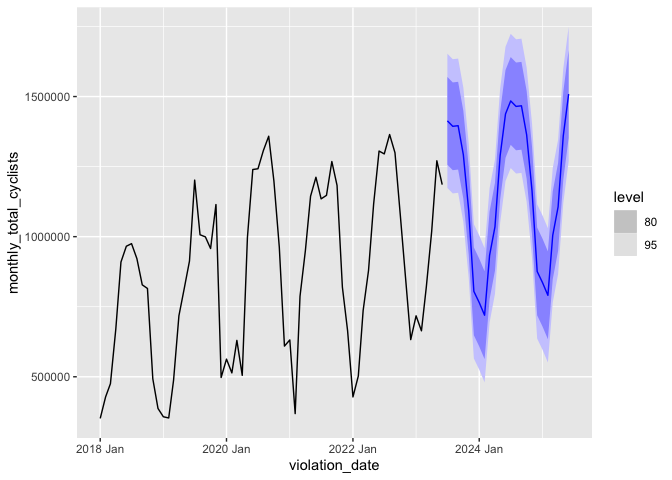<!-- -->

How does it perform on the test set?


```r
fct <- train_monthly |> 
  model(ETS(monthly_total_cyclists ~ error("A") + trend("A") + season("A"))) |> 
  forecast(test_monthly)

(RMSE_ETS_AAA_monthly <-accuracy(fct, ts_monthly_total)$RMSE)
```

```
## [1] 86248.05
```

RMSE = 86248.05.  Better

### Visualize ETS_AAA


```r
autoplot(train_monthly) +
  autolayer(fct, PI = F, size=0.7)+
  autolayer(test_monthly)
```

```
## Plot variable not specified, automatically selected `.vars =
## monthly_total_cyclists`
```

```
## Warning in distributional::geom_hilo_ribbon(intvl_mapping, data =
## dplyr::anti_join(interval_data, : Ignoring unknown parameters: `PI`
```

```
## Warning in distributional::geom_hilo_linerange(intvl_mapping, data =
## dplyr::semi_join(interval_data, : Ignoring unknown parameters: `PI`
```

```
## Warning in geom_line(mapping = mapping, data = dplyr::anti_join(object, :
## Ignoring unknown parameters: `PI`
```

```
## Warning in ggplot2::geom_point(mapping = mapping, data =
## dplyr::semi_join(object, : Ignoring unknown parameters: `PI`
```

```
## Plot variable not specified, automatically selected `.vars =
## monthly_total_cyclists`
```

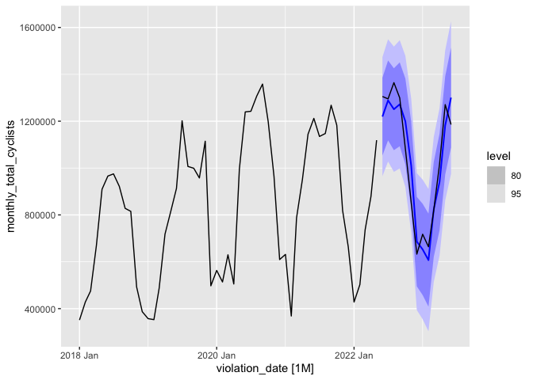<!-- -->


Maybe the trend was too strong.  I wonder if we can do damping

## ETS with trend damping (ETS_AAdA)


```r
fct_ETS_AAdA <- train_monthly |> 
  model(ETS(monthly_total_cyclists ~ error("A") + trend("Ad") + season("A"))) |> 
  forecast(test_monthly)

(RMSE_ETS_AAdA <-accuracy(fct_ETS_AAdA, ts_monthly_total)$RMSE)
```

```
## [1] 94780.86
```

RMSE: 94780.86

### Vusialize ETS with trend damping


```r
autoplot(train_monthly) +
  autolayer(fct_ETS_AAdA, size=0.7)+
  autolayer(test_monthly)
```

<!-- -->

Does it look different when we train it on all of the data and forecast 2 years?


```r
fit_ETS <- ts_monthly_total %>%
  model(ETS(monthly_total_cyclists ~ error("A") + trend("Ad") + season("A")))

fc <- fit_ETS |> forecast(h = "2 years")

fc |> 
  autoplot(ts_monthly_total)
```

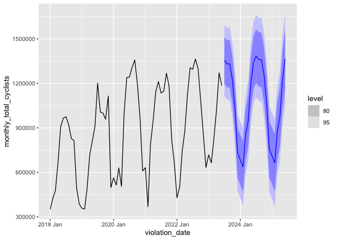<!-- -->

Just by looking at it, the peak in the summer of 2024 doesn't reach as high.  It's a little more conservative of an estimation.  


## Auto-ETS (ETS_ANA)

What does the ETS command itself decide to be the best model for the training data?


```r
mod_Auto_ETS <-train_monthly |> 
  model(ETS(monthly_total_cyclists))

report(mod_Auto_ETS)
```

```
## Series: monthly_total_cyclists 
## Model: ETS(M,N,M) 
##   Smoothing parameters:
##     alpha = 0.2216783 
##     gamma = 0.001491242 
## 
##   Initial states:
##      l[0]      s[0]    s[-1]    s[-2]    s[-3]    s[-4]    s[-5]    s[-6]
##  803725.1 0.6281845 1.029139 1.201712 1.309121 1.326011 1.375032 1.270792
##     s[-7]     s[-8]     s[-9]    s[-10]    s[-11]
##  1.133651 0.9010088 0.7275075 0.5323516 0.5654901
## 
##   sigma^2:  0.029
## 
##      AIC     AICc      BIC 
## 1472.030 1485.003 1501.584
```

It has chosen a much different model, MNM.  Let's see how it does on the test data


```r
fct_ETS_MNM <- mod_Auto_ETS |> 
  forecast(test_monthly)


(RMSE_ETS_MNM <-accuracy(fct_ETS_MNM, ts_monthly_total)$RMSE)
```

```
## [1] 116723.8
```

The RMSE is 116723.8.  Not the best.  

How would an ARIMA model fare?

## Auto-ARIMA model 

Let's see what ARIMA model the auto-ARIMA chooses.


```r
mod_Auto_ARIMA <- train_monthly |> 
  model(ARIMA(monthly_total_cyclists)) 

report(mod_Auto_ARIMA)
```

```
## Series: monthly_total_cyclists 
## Model: ARIMA(1,0,0)(1,1,0)[12] w/ drift 
## 
## Coefficients:
##         ar1     sar1  constant
##       0.283  -0.4714  85295.70
## s.e.  0.148   0.1474  26338.72
## 
## sigma^2 estimated as 2.51e+10:  log likelihood=-549.07
## AIC=1106.14   AICc=1107.25   BIC=1112.99
```

'Auto-ARIMA' has chosen an ARIMA(1,0,0)(1,1,0)[12] w/ drift model for the train dataset.  Let's see how it scores on the test dataset


```r
fct_Auto_ARIMA <- mod_Auto_ARIMA |> 
  forecast(test_monthly)

(RMSE_ARIMA_100_110_12 <-accuracy(fct_Auto_ARIMA, ts_monthly_total)$RMSE)
```

```
## [1] 114677.4
```

114677.4.  Not nearly as good as out best ETS.

Let's see what it's forecast looks like:


```r
autoplot(train_monthly) +
  autolayer(fct_Auto_ARIMA, size=0.7)+
  autolayer(test_monthly)
```

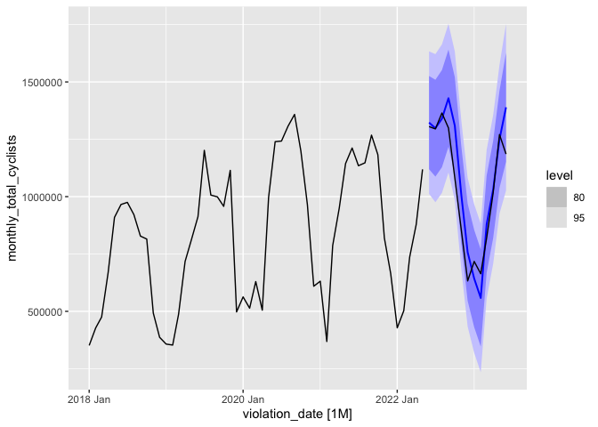<!-- -->

# Model Summations


```r
cat('seasonal Naive:\t\t\t', RMSE_seasonal_naive_monthly, '\n', 
    'ETS_AAA:\t\t\t', RMSE_ETS_AAA_monthly, '\n',
    'ETS_AAdA:\t\t\t', RMSE_ETS_AAdA, '\n',
    'ETS_ANA:\t\t\t', RMSE_ETS_MNM, '\n',
    'ARIMA (1,0,0)(1,1,0)[12]\t', RMSE_ARIMA_100_110_12)
```

```
## seasonal Naive:			 139936.1 
##  ETS_AAA:			 86248.05 
##  ETS_AAdA:			 94780.86 
##  ETS_ANA:			 116723.8 
##  ARIMA (1,0,0)(1,1,0)[12]	 114677.4
```


```r
tests <- c('Seasonal Naive', 'ETS_AAA', 'ETS_AAdA', 'ETS_MNM',  'ARIMA (1,0,0)(1,1,0)[12]')
RMSE <- c(RMSE_seasonal_naive_monthly, RMSE_ETS_AAA_monthly, RMSE_ETS_AAdA, RMSE_ETS_MNM, RMSE_ARIMA_100_110_12)

df_forecasting <- data.frame(tests, RMSE)

df_forecasting |> 
  kable(caption = "Forecasts", col.names = linebreak(c('Forecasting Method', 'RMSE'), align = "l")) |> 
  kable_classic(full_width = F, html_font = "Cambria", position = "left")
```

<table class=" lightable-classic" style="font-family: Cambria; width: auto !important; ">
<caption>Forecasts</caption>
 <thead>
  <tr>
   <th style="text-align:left;"> Forecasting Method </th>
   <th style="text-align:right;"> RMSE </th>
  </tr>
 </thead>
<tbody>
  <tr>
   <td style="text-align:left;"> Seasonal Naive </td>
   <td style="text-align:right;"> 139936.10 </td>
  </tr>
  <tr>
   <td style="text-align:left;"> ETS_AAA </td>
   <td style="text-align:right;"> 86248.05 </td>
  </tr>
  <tr>
   <td style="text-align:left;"> ETS_AAdA </td>
   <td style="text-align:right;"> 94780.86 </td>
  </tr>
  <tr>
   <td style="text-align:left;"> ETS_MNM </td>
   <td style="text-align:right;"> 116723.76 </td>
  </tr>
  <tr>
   <td style="text-align:left;"> ARIMA (1,0,0)(1,1,0)[12] </td>
   <td style="text-align:right;"> 114677.35 </td>
  </tr>
</tbody>
</table>


##TS regression model

Correlation


```r
cor(ts_monthly_total$monthly_total_cyclists, ts_monthly_total$monthly_total_violations)
```

```
## [1] -0.1035314
```

The correlation is very small 

Is there a linear relationship between monthly violations and total cyclists?


```r
ts_monthly_total |> 
  ggplot(aes(x=monthly_total_violations, y=monthly_total_cyclists))+
  geom_point()
```

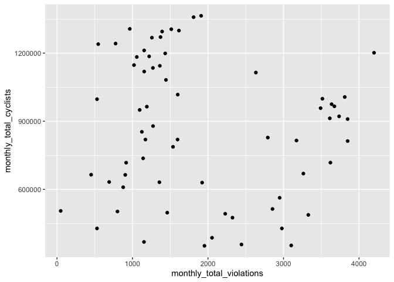<!-- -->

Takeway:  it looks like there might be two separate groups here.  My guess is that the groups are pre-covid and post.  Let's just look at post covid:

Post covid cor:


```r
ts_monthly_total |> 
  filter_index('2020-04'~.) |> 
  select(monthly_total_violations, monthly_total_cyclists) |> 
  correlate()
```

<div data-pagedtable="false">
  <script data-pagedtable-source type="application/json">
{"columns":[{"label":["term"],"name":[1],"type":["chr"],"align":["left"]},{"label":["monthly_total_violations"],"name":[2],"type":["dbl"],"align":["right"]},{"label":["monthly_total_cyclists"],"name":[3],"type":["dbl"],"align":["right"]}],"data":[{"1":"monthly_total_violations","2":"NA","3":"0.5053488"},{"1":"monthly_total_cyclists","2":"0.5053488","3":"NA"}],"options":{"columns":{"min":{},"max":[10]},"rows":{"min":[10],"max":[10]},"pages":{}}}
  </script>
</div>

The correlation is now 0.5053488  Much better.

Post covid plot:


```r
ts_monthly_total |> 
  filter_index('2020-04' ~.) |> 
  ggplot(aes(x=monthly_total_violations , y=monthly_total_cyclists))+
  geom_point()+
  geom_smooth(method = "lm", se = FALSE)
```

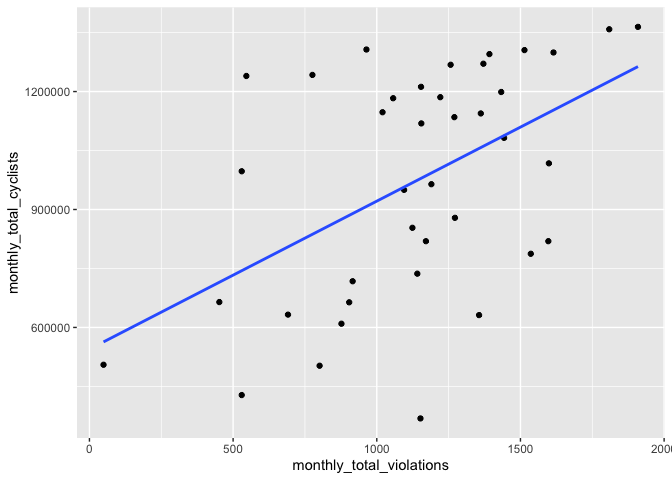<!-- -->

Looks better.  What if we color it by month?


```r
ts_monthly_total |> 
  filter_index('2020-04' ~.) |> 
  mutate(month=as.factor(month(violation_date))) |> 
  ggplot(aes(x=monthly_total_violations, y=monthly_total_cyclists, col=month))+
  geom_point()
```

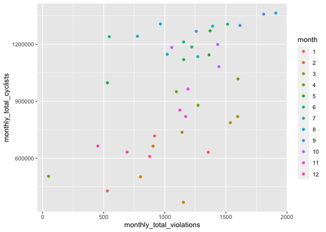<!-- -->

Takeaway: Visually, the months do seem to cluster together.  

double-check: is that april that's  month number 4 in the green with the minimum violations?


```r
ts_monthly_total |> 
  filter_index('2020-04' ~.) |> 
  slice(which.min(monthly_total_violations))
```

<div data-pagedtable="false">
  <script data-pagedtable-source type="application/json">
{"columns":[{"label":["violation_date"],"name":[1],"type":["mth"],"align":["right"]},{"label":["monthly_total_cyclists"],"name":[2],"type":["dbl"],"align":["right"]},{"label":["monthly_total_violations"],"name":[3],"type":["int"],"align":["right"]}],"data":[{"1":"2020 Apr","2":"505104","3":"49"}],"options":{"columns":{"min":{},"max":[10]},"rows":{"min":[10],"max":[10]},"pages":{}}}
  </script>
</div>

Yes.  So we can safely assume that month 1 is Jan, 2 is Feb, etc.


### TS Reg model (post covid)

Without trend or season:


```r
ts_reg_mod1 <- ts_monthly_total |> 
  filter_index('2020-04' ~.) |> 
	model(TSLM(monthly_total_cyclists ~ monthly_total_violations))

report(ts_reg_mod1)
```

```
## Series: monthly_total_cyclists 
## Model: TSLM 
## 
## Residuals:
##     Min      1Q  Median      3Q     Max 
## -609938 -172230   -5872  200244  489287 
## 
## Coefficients:
##                          Estimate Std. Error t value Pr(>|t|)    
## (Intercept)              544748.2   126737.8   4.298  0.00012 ***
## monthly_total_violations    376.5      105.7   3.562  0.00103 ** 
## ---
## Signif. codes:  0 '***' 0.001 '**' 0.01 '*' 0.05 '.' 0.1 ' ' 1
## 
## Residual standard error: 256000 on 37 degrees of freedom
## Multiple R-squared: 0.2554,	Adjusted R-squared: 0.2353
## F-statistic: 12.69 on 1 and 37 DF, p-value: 0.0010329
```


Terrible adjusted R-square (0.2353)

With slope and season:


```r
ts_reg_mod2 <- ts_monthly_total |> 
  filter_index('2020-04' ~.) |> 
	model(TSLM(monthly_total_cyclists ~ monthly_total_violations+ trend() + season()))

report(ts_reg_mod2)
```

```
## Series: monthly_total_cyclists 
## Model: TSLM 
## 
## Residuals:
##     Min      1Q  Median      3Q     Max 
## -161214  -33677   -5005   62374  145382 
## 
## Coefficients:
##                           Estimate Std. Error t value Pr(>|t|)    
## (Intercept)              411207.66   70253.15   5.853 4.18e-06 ***
## monthly_total_violations    164.78      52.79   3.121  0.00450 ** 
## trend()                    1236.76    1524.41   0.811  0.42485    
## season()year2            -84879.71   76190.30  -1.114  0.27585    
## season()year3            105522.93   80066.18   1.318  0.19947    
## season()year4            237715.71   71607.58   3.320  0.00277 ** 
## season()year5            514878.71   72064.12   7.145 1.73e-07 ***
## season()year6            615802.89   71958.61   8.558 6.73e-09 ***
## season()year7            604311.43   78141.97   7.734 4.33e-08 ***
## season()year8            626866.86   79777.02   7.858 3.25e-08 ***
## season()year9            618066.49   84374.16   7.325 1.13e-07 ***
## season()year10           503963.28   79396.53   6.347 1.21e-06 ***
## season()year11           251709.51   77398.44   3.252  0.00327 ** 
## season()year12            87401.15   77300.89   1.131  0.26893    
## ---
## Signif. codes:  0 '***' 0.001 '**' 0.01 '*' 0.05 '.' 0.1 ' ' 1
## 
## Residual standard error: 93300 on 25 degrees of freedom
## Multiple R-squared: 0.9332,	Adjusted R-squared: 0.8984
## F-statistic: 26.86 on 13 and 25 DF, p-value: 1.8711e-11
```

Takeaway:  The adjusted R^2 is 0.8984, which is very good. June-Sept seems to have the highest beta values.  monthly total violations has a tiny beta value, by far.  This shows that seasonality has a larger impact on total cyclists than monthly total violations.


Is monthly total cyclists normally distributed?  


```r
shapiro.test(ts_monthly_total$monthly_total_cyclists) # no:  p-value = 0.0079
```

```
## 
## 	Shapiro-Wilk normality test
## 
## data:  ts_monthly_total$monthly_total_cyclists
## W = 0.94811, p-value = 0.0079
```

```r
qqnorm(ts_monthly_total$monthly_total_cyclists)
```

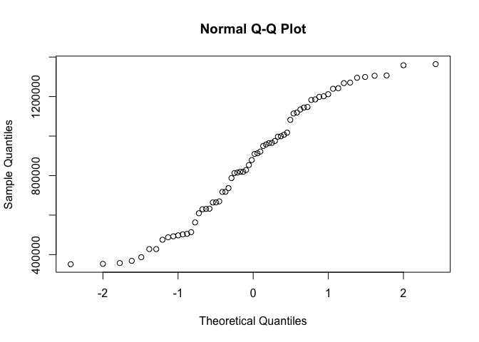<!-- -->


Ans: NO


## To do: Can we foreast daily violations?


# ETS_AAA (best model) evaluation


```r
mod_ETS_AAA <- train_monthly %>%
  model(ETS(monthly_total_cyclists ~ error("A") + trend("A") + season("A")))

gg_tsresiduals(mod_ETS_AAA)+
  ggtitle('ETS AAA Residuals')
```

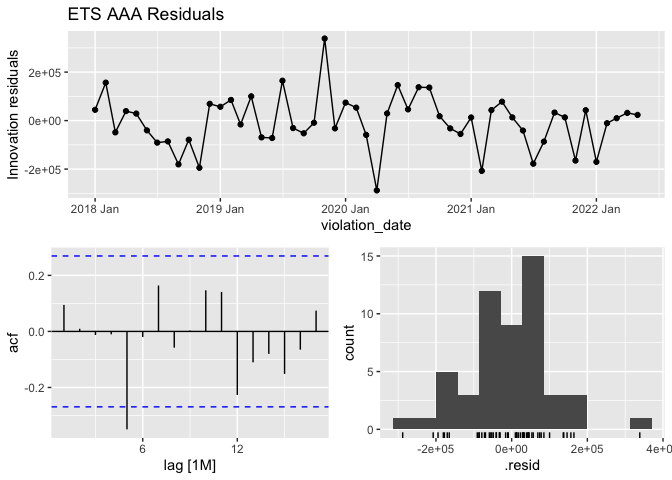<!-- -->

Takeaway: resids look normal enough.  possible autocorrelation. Tests:


```r
augment(mod_ETS_AAA) |> features(.innov, box_pierce, lag = 12)
```

<div data-pagedtable="false">
  <script data-pagedtable-source type="application/json">
{"columns":[{"label":[".model"],"name":[1],"type":["chr"],"align":["left"]},{"label":["bp_stat"],"name":[2],"type":["dbl"],"align":["right"]},{"label":["bp_pvalue"],"name":[3],"type":["dbl"],"align":["right"]}],"data":[{"1":"ETS(monthly_total_cyclists ~ error(\"A\") + trend(\"A\") + season(\"A\"))","2":"13.51128","3":"0.3329984"}],"options":{"columns":{"min":{},"max":[10]},"rows":{"min":[10],"max":[10]},"pages":{}}}
  </script>
</div>

```r
augment(mod_ETS_AAA) |> features(.innov, ljung_box, lag = 12)
```

<div data-pagedtable="false">
  <script data-pagedtable-source type="application/json">
{"columns":[{"label":[".model"],"name":[1],"type":["chr"],"align":["left"]},{"label":["lb_stat"],"name":[2],"type":["dbl"],"align":["right"]},{"label":["lb_pvalue"],"name":[3],"type":["dbl"],"align":["right"]}],"data":[{"1":"ETS(monthly_total_cyclists ~ error(\"A\") + trend(\"A\") + season(\"A\"))","2":"16.38223","3":"0.1743495"}],"options":{"columns":{"min":{},"max":[10]},"rows":{"min":[10],"max":[10]},"pages":{}}}
  </script>
</div>

Both tests fail to reject null.  We may safely conclude that residuals are white noise.


```r
shapiro.test(residuals(mod_ETS_AAA)$.resid)
```

```
## 
## 	Shapiro-Wilk normality test
## 
## data:  residuals(mod_ETS_AAA)$.resid
## W = 0.96876, p-value = 0.1783
```


Let's forecast through 2025


```r
fct_ETS_AAA <- train_monthly |> 
  model(ETS(monthly_total_cyclists ~ error("A") + trend("A") + season("A"))) |> 
  forecast(h=36)

ts_monthly_total |> 
  autoplot(monthly_total_cyclists) +
  #autoplot(ts_monthly_total$monthly_total_cyclists) +
  autolayer(fct_ETS_AAA, size=0.7)+
  autolayer(test_monthly)
```

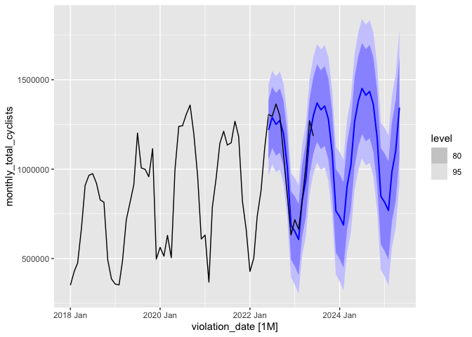<!-- -->


```r
tidy(mod_ETS_AAA)
```

<div data-pagedtable="false">
  <script data-pagedtable-source type="application/json">
{"columns":[{"label":[".model"],"name":[1],"type":["chr"],"align":["left"]},{"label":["term"],"name":[2],"type":["chr"],"align":["left"]},{"label":["estimate"],"name":[3],"type":["dbl"],"align":["right"]}],"data":[{"1":"ETS(monthly_total_cyclists ~ error(\"A\") + trend(\"A\") + season(\"A\"))","2":"alpha","3":"2.309964e-01"},{"1":"ETS(monthly_total_cyclists ~ error(\"A\") + trend(\"A\") + season(\"A\"))","2":"beta","3":"1.000245e-04"},{"1":"ETS(monthly_total_cyclists ~ error(\"A\") + trend(\"A\") + season(\"A\"))","2":"gamma","3":"1.004740e-04"},{"1":"ETS(monthly_total_cyclists ~ error(\"A\") + trend(\"A\") + season(\"A\"))","2":"l[0]","3":"6.685853e+05"},{"1":"ETS(monthly_total_cyclists ~ error(\"A\") + trend(\"A\") + season(\"A\"))","2":"b[0]","3":"6.789257e+03"},{"1":"ETS(monthly_total_cyclists ~ error(\"A\") + trend(\"A\") + season(\"A\"))","2":"s[0]","3":"-3.283937e+05"},{"1":"ETS(monthly_total_cyclists ~ error(\"A\") + trend(\"A\") + season(\"A\"))","2":"s[-1]","3":"2.910930e+03"},{"1":"ETS(monthly_total_cyclists ~ error(\"A\") + trend(\"A\") + season(\"A\"))","2":"s[-2]","3":"1.982305e+05"},{"1":"ETS(monthly_total_cyclists ~ error(\"A\") + trend(\"A\") + season(\"A\"))","2":"s[-3]","3":"2.778861e+05"},{"1":"ETS(monthly_total_cyclists ~ error(\"A\") + trend(\"A\") + season(\"A\"))","2":"s[-4]","3":"2.636423e+05"},{"1":"ETS(monthly_total_cyclists ~ error(\"A\") + trend(\"A\") + season(\"A\"))","2":"s[-5]","3":"3.080297e+05"},{"1":"ETS(monthly_total_cyclists ~ error(\"A\") + trend(\"A\") + season(\"A\"))","2":"s[-6]","3":"2.456962e+05"},{"1":"ETS(monthly_total_cyclists ~ error(\"A\") + trend(\"A\") + season(\"A\"))","2":"s[-7]","3":"1.337814e+05"},{"1":"ETS(monthly_total_cyclists ~ error(\"A\") + trend(\"A\") + season(\"A\"))","2":"s[-8]","3":"-1.006068e+05"},{"1":"ETS(monthly_total_cyclists ~ error(\"A\") + trend(\"A\") + season(\"A\"))","2":"s[-9]","3":"-2.116233e+05"},{"1":"ETS(monthly_total_cyclists ~ error(\"A\") + trend(\"A\") + season(\"A\"))","2":"s[-10]","3":"-4.209748e+05"},{"1":"ETS(monthly_total_cyclists ~ error(\"A\") + trend(\"A\") + season(\"A\"))","2":"s[-11]","3":"-3.685786e+05"}],"options":{"columns":{"min":{},"max":[10]},"rows":{"min":[10],"max":[10]},"pages":{}}}
  </script>
</div>


Takeaway:  This model seems to adequately increase the summer peaks while slowly increasing the winter lulls.  This fits our eda.  
